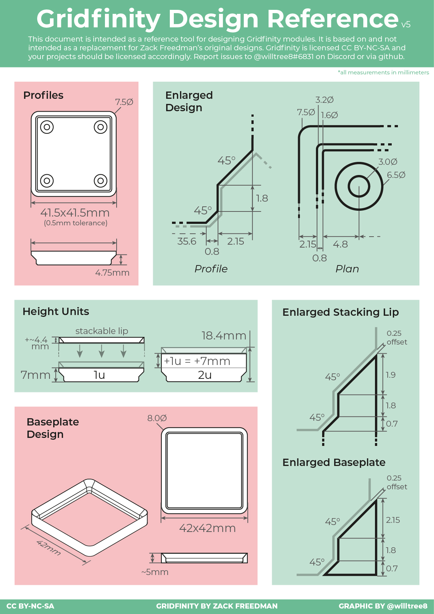

# Gridfinity

This project contains Tcl scripts for the Gridfinity project. For more information, visit the [Gridfinity website](https://gridfinity.xyz).

## Getting Started

To get started with this project, clone the repository and navigate to the project directory:

```sh
git clone <repository-url>
cd gridfinity
```

## Prerequisites

This is intended to run on an OpenCASCADE DRAW interpreter. You can download OpenCASCADE from [OpenCASCADE's official website](https://www.opencascade.com/).

## Running the Scripts

To run a Tcl script, use the following command in a DRAW session:

```sh
source <script-name>.tcl
```

## Contributing

If you would like to contribute to this project, please fork the repository and submit a pull request.

## License

This project is licensed under the MIT License.

## Gridfinity basics


This geometries are created with script draw_scripts/basics.tcl